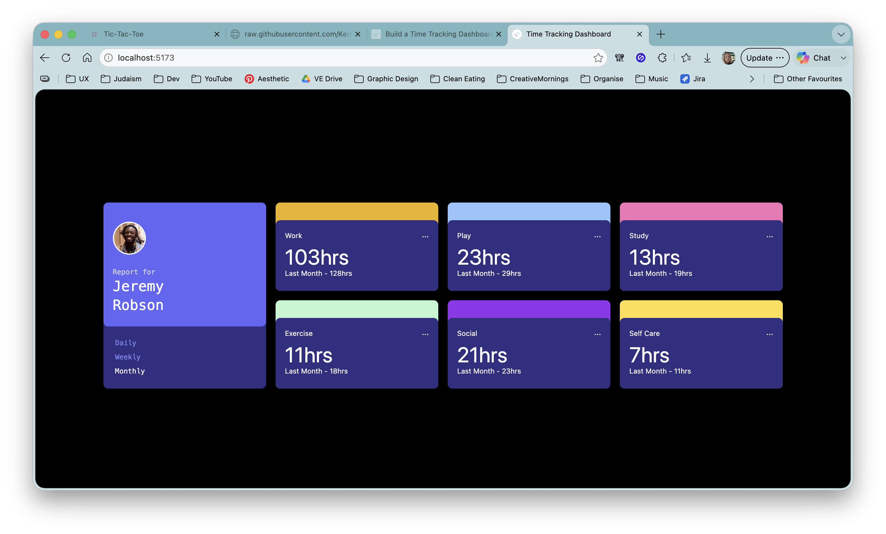

# Frontend Mentor - Time Tracking Dashboard

A solution to the [Time Tracking Dashboard](https://www.frontendmentor.io/challenges/time-tracking-dashboard-UIQ7167Jw) challenge on Frontend Mentor.

## Overview

A dashboard that displays time tracked across six activity categories. Users can toggle between daily, weekly, and monthly views to see current and previous period hours.



## Links

- [Live site](https://timetracking.kerryclements.com)
- [Frontend Mentor challenge](https://www.frontendmentor.io/challenges/time-tracking-dashboard-UIQ7167Jw)

## Built with

- React 18
- TypeScript
- Vite
- Tailwind CSS v3

## What I did

I originally built this in 2022 with Create React App and React 17. The layout was complete but the timeframe switching was never wired up. All data was hardcoded as strings directly in the JSX.

In 2026 I came back to it to finish and modernise it:

- Migrated from CRA to Vite
- Added TypeScript throughout, including typed interfaces for the activity data and a `TimeFrame` union type
- Replaced hardcoded data with `data.json` and a constants file
- Wired up the Daily / Weekly / Monthly switching with `useState`
- Moved category colours and previous period labels into a constants file
- Replaced non-interactive `div` elements with semantic `button` elements
- Added `aria-pressed` to timeframe buttons and `aria-label` to card menu buttons

## Running locally

```bash
npm install
npm run dev
```
